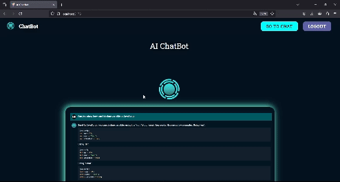

# ChatBot - OpenAI API

This is a chat developed with the MERN Stack and using the OpenAI API - GPT 3.5 Turbo Model. The chat is a simpler version of the ChatGPT App and was developed as a template project. It allows user creation and login, and once in the chat interface, you can interact with the model through text.

__Note__: This chat was developed based on a MERN Stack and OpenAI free course released on the FreeCodeCamp YouTube Channel.

## Main Technologies

* __Frontend__: React & MUI 
* __Backend__: Node.Js & Express.Js
* __DataBase__: Mongo DB

## Demo

